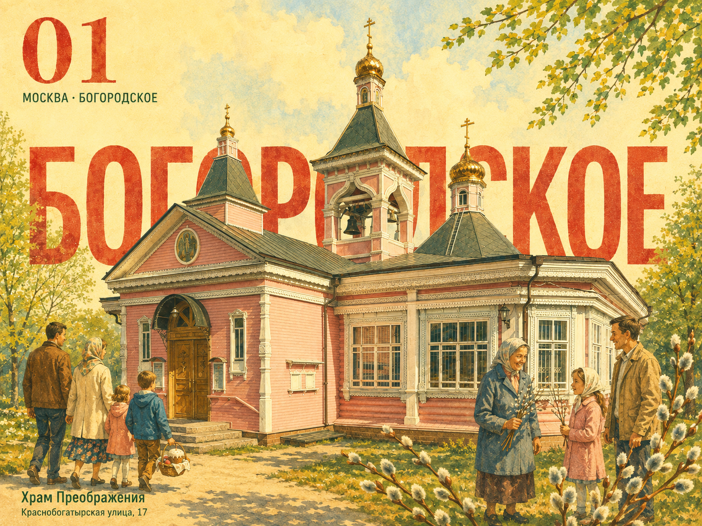
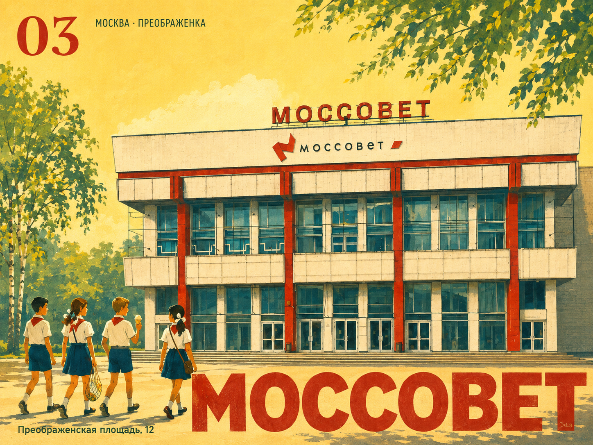
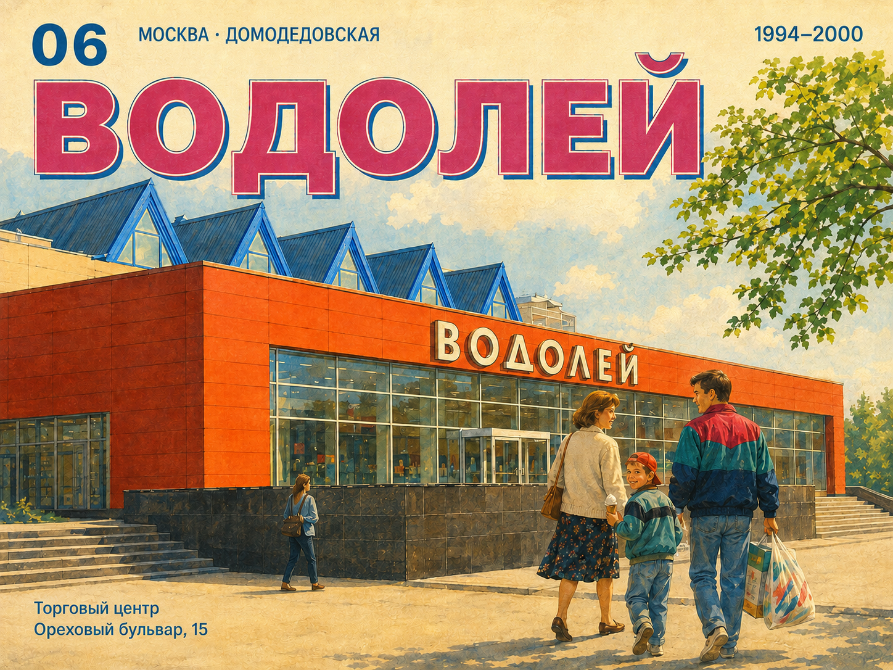

# Зодчество — московская серия плакатов

Десять иллюстрированных плакатов о Москве: от Богородского и Преображенской площади до Домодедовской и Орехово-Борисово. Серия соединяет узнаваемую архитектуру, районные истории и ясную кириллическую типографику.

## Примеры сгенерированных плакатов

Три примера из коллекции. Все десять финальных плакатов доступны в [output/](output/).

### Богородское — Храм Преображения



### Преображенская площадь — Моссовет



### Домодедовская — Водолей



## Галерея

[Открыть общую галерею](index.html) — десять финальных плакатов, по одной версии каждого сюжета.

- [Богородское — светлые версии храма, каланчи и фабрики](posters/bogorodskoe-preobrazhenskaya/03-positive-series/README.md)
- [Преображенская площадь — светлый Моссовет](posters/bogorodskoe-preobrazhenskaya/02-mossovet-positive/README.md)
- [Домодедовская — Авангард и Водолей](posters/domodedovskaya-orekhovo-borisovo/01-avangard-vodoley/README.md)
- [Рынок, Борисовские пруды, Царицыно и дендропарк](posters/domodedovskaya-orekhovo-borisovo/02-market-ponds-parks/README.md)

Десять актуальных PNG имеют размер 1448×1086 (4:3). Все 10 готовых изображений лежат в одной папке [output/](output/), без вложенных каталогов. Имена включают район, запрос и сюжет. В папках запросов находятся исходники, промпты и метаданные со ссылками на результаты.

## Структура

```text
index.html                         общая галерея
output/*.png                       все финальные изображения
scripts/build_gallery.py           сборка и проверка галереи
posters/
  bogorodskoe-preobrazhenskaya/
    02-mossovet-positive/
    03-positive-series/
  domodedovskaya-orekhovo-borisovo/
    01-avangard-vodoley/
    02-market-ponds-parks/
    03-vodoley-fix/
```

Каждый запрос имеет одинаковое устройство:

```text
<request>/
  README.md                 список результатов этого запроса
  input/<poster-id>/        использованные входные файлы
  prompt/request.md         формулировка запроса
  prompt/<poster-id>.txt    точный отправленный промпт
  metadata/request.json    общий формат: результаты, входы, пути и хеши
  metadata/<poster-id>/    сохранённые подробные метаданные
  metadata/request-context/ общие разборы и источники, если были
```

Пути в `metadata/request.json` отсчитываются от папки запроса. Исторические метаданные сохранены отдельно от этого единого манифеста. Старое дерево целиком перемещено в локальный `archive/legacy/`, исключённый из git; изображения и точные промпты перенесены без изменений.

## Состав серии

| № | Сюжет | Районный мотив |
|---|---|---|
| 01 | Храм Преображения | Пасха, семьи, весна и верба |
| 02 | Каланча | Пожарные, передышка и восхищение |
| 03 | Моссовет | Советское кино, Сокольники и пионеры |
| 04 | Красный богатырь | Рабочие, индустриализация и сила |
| 05 | Авангард | Молодёжная встреча и кассетный плеер |
| 06 | Водолей | Семейная прогулка и торговая суббота |
| 07 | Домодедовский рынок | Продукты и районная торговая жизнь |
| 08 | Борисовские пруды | Вода, берег и летний маршрут |
| 09 | Царицыно | Дворец и парк |
| 10 | Бирюлёвский дендропарк | Берёзы, пруд и тихая прогулка |

## Метод

Для нового запроса достаточно указать место, настроение, эпоху и нужные надписи. Генерация выполняется встроенным инструментом; результат сохраняется в общей папке `output/`, а точный промпт и метаданные — в новой папке запроса. Фотографии и референсы можно использовать, если они уже есть или нужны пользователю. Поиск референсов, изготовление подложек и отдельная подгонка кириллицы не являются обязательными шагами.

Подложки и фотографии в старых запросах отражают фактически использованный процесс. Их наличие не задаёт требования к новым запросам.

Галерея собирается без сторонних библиотек и локальных путей конкретного компьютера:

```bash
python3 scripts/build_gallery.py
```

Скрипт проверяет входы, промпты, результаты по SHA-256 и локальные ссылки галереи.

## Публикация и права

Сведения о материалах — в [ARTWORK-LICENSE.md](ARTWORK-LICENSE.md) и сохранённых `SOURCES.md` внутри `metadata/request-context/`. Фотографии имеют собственные условия использования.

Код упаковки и локальных проверок распространяется под [MIT](LICENSE). Права на созданные изображения и исходные фотографии регулируются отдельным файлом с атрибуцией.

## Генерация по своей фотографии

Откройте репозиторий в Codex, приложите фотографию и попросите:

> Создай плакат по моей фотографии в стиле этой коллекции. Используй мою фотографию как референс архитектуры, а готовые плакаты из output/ — как визуальные референсы стиля. Настроение: тёплое и позитивное. Надпись: «Мой район».

Агент должен просмотреть фотографию и выбрать 1–2 подходящих финальных плаката из `output/`, затем передать сами изображения инструменту генерации вместе с фото. Для светлой советской стилистики базовый ориентир — Моссовет (`*02-mossovet-positive*`); для эстетики 1994–2000 — Авангард или Водолей (`*01-avangard-vodoley*`). Фото задаёт архитектуру и композиционные особенности места, плакаты — палитру, рисовку и настроение. Их надписи и здания не нужно копировать.

Новые результаты сохраняются в `output/`; исходная фотография, использованные стилевые референсы, точный промпт и метаданные — в новой папке запроса. Внешний поиск референсов не нужен. Генерация требует доступного инструмента изображений в среде пользователя; сам репозиторий не содержит отдельного генерационного сервиса.

«Водолей»: [финальная правка положения девушки](posters/domodedovskaya-orekhovo-borisovo/03-vodoley-fix/README.md).
